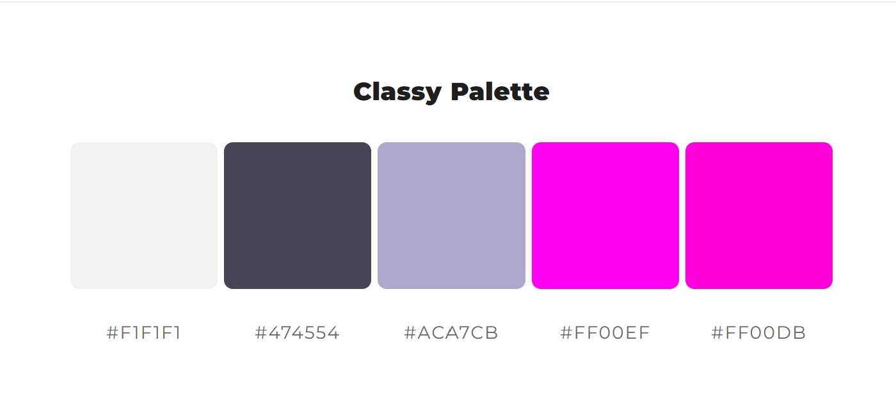
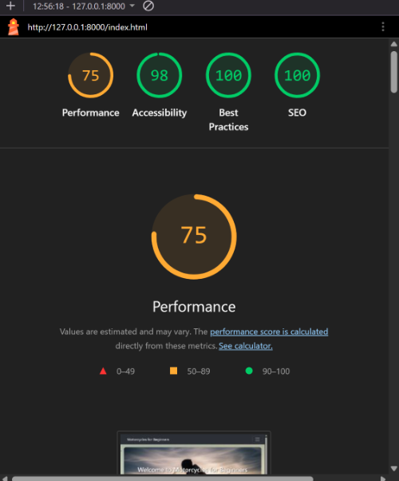
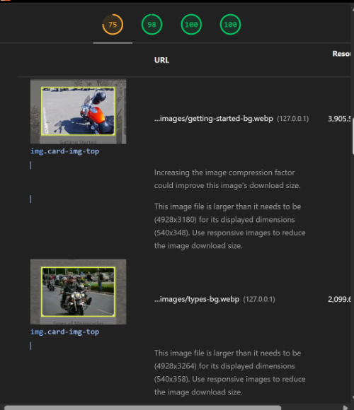
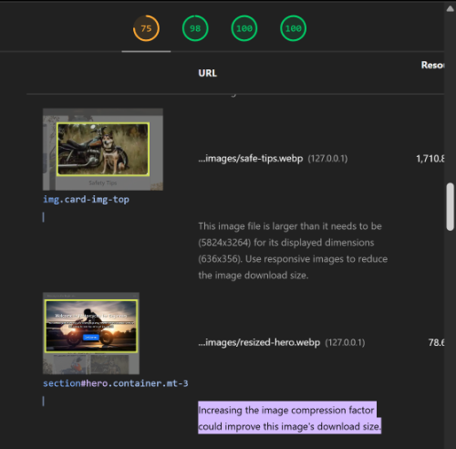
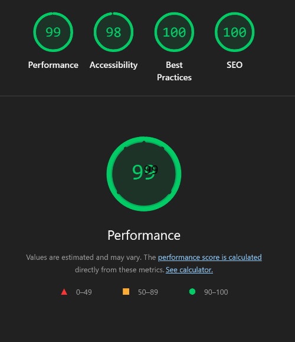
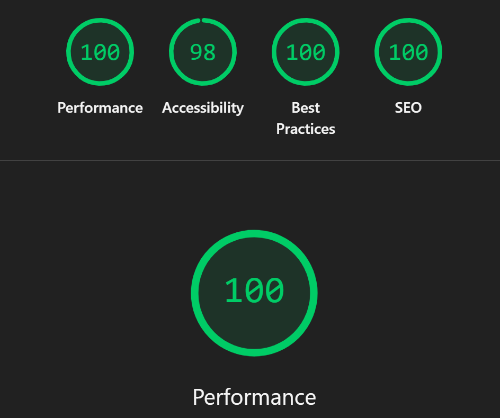

# Motorbikes-for-beginners

### This is my submission for the Web Application Development Milestone 1 project.

### Live site link - <a href='https://bikerbrandon2282.github.io/motorbikes-for-beginners/'>Motorbikes for beginners</a>

## Owner Goals
- To promote motorcycles and bring more interest to the community
- To help new riders decide what style of bikes and riding they prefer
- To publish most important information about the hobby or lifestyle in one, easy to find place.
## User Goals
- To easily see different styles of bikes
- To learn about the different options available
- To decide whether this is a hobby or a lifestyle I'm interested in.

## Development
- As I currently have nothing, I must first build the HTML boilerplate with a starting structure, pick a navigation style
- I have also created some user stories to help build the website and track my progress with a priority marker to indicate the order the features must be implemented 
- Before building the website I built a basic wireframe in order to guide me on the layout of the homepage and rough layout of how the whole site will look. (see screenshot below)

## Future Features
- There will be a newsletter form the user can sign up to in order to receieve a frequent update about the next events coming up based on their age and how frequent they would like the update

## Deployment Procedure
- Login to Github
- Locate the Motorbikes-for-beginners Repository
- Navigate to the Repo's settings page
- open the pages tab in the Code and automation section
- choose from the Branch dropdown menu 'main' as we want to deploy the site from the main branch
- Ensure the '/root' folder is selected in the next dropdown menu and click save.
- Wait a few minutes for the page to be built, then go to the main 'code' tab to find the Deployment section along side the code (see screenshot below) and click the link to 'github-pages' as this is the environment we deployed with.

- You should now see a screen like below with your link to your deployed website.

## Attribrutions

Below is the images I have used for this project, Most came from a Website called <a href='https://pngtree.com'>pngtree.com</a> All were then converted to WEBP images using a website called <a href='https://freeconvert.com/png-to-webp'>freeconvert.com</a> 
- Main background of webpages >  <a href='https://pngtree.com/freebackground/beautiful-woman-riding-a-motorcycle-at-dusk_1497215.html'>free background photos from pngtree.com</a> This photo is still in images folder however is no longer in use.
- Types of Licences background >  <a href='https://pngtree.com/freebackground/red-touring-motorcycle-parked-on-scenic-mountain-road-at-golden-hour-sunset_20270343.html'>free background photos from pngtree.com</a>
- Road Awareness background > <a href='https://pngtree.com/freebackground/a-cyclist-on-the-road-in-autumn-wearing-an-orange-jacket-and-black-helmet-with-gray-backpack-rides-their-bike-through-traffic_16416635.html'>background photo from pngtree.com</a>
- Maintenance background > <a href= 'https://pngtree.com/freebackground/vintage-motorcycle-headlight_15570017.html'>background photo from pngtree.com</a>
- Hero section background > <a href= 'https://pngtree.com/freebackground/silhouetted-motorcyclist-speeding-along-track-at-sunset-with-sun-glowing-through-wheels-conveying-action-and-freedom_20056758.html'>background photo from pngtree.com</a>
- Sportbikes card background > <a href= 'https://pngtree.com/freebackground/high-performance-motorcycle-with-smoke-clouds-adding-a-sense-of-action-and-speed_16142787.html'>background photo from pngtree.com</a>
- Cruiser card background > <a href= 'https://pngtree.com/freebackground/vintage-style-steampunk-motorcycle-with-ornate-details_16285673.html'>background photo from pngtree.com</a>
- Dirtbikes background > <a href= 'https://pngtree.com/freebackground/nighttime-motocross-fury-rider-in-action_16050274.html'>background photo from pngtree.com</a>
- Standard bikes background > <a href= 'https://pngtree.com/freebackground/motorcycles-at-the-bmw-show-during-the-day-without-photographs-in-the-car-interior_1521790.html'>background photo from pngtree.com</a>
- Riding Restrictions section background > <a href= 'https://pngtree.com/freebackground/sleek-black-motorcycle-with-chrome-accents-against-abstract-textured-background_16733140.html'>background photo from pngtree.com</a>
- Licence Requirements section background > <a href= 'https://pngtree.com/freebackground/motorcycles-is-lined-up-on-a-street_3167491.html'>background photo from pngtree.com</a>
- Types of bikes section background > <a href= 'https://stock.adobe.com/search?k=motorbike+background&asset_id=331783924'>background photo from stock.adobe.com</a>
- Essential tips section background > <a href= 'https://pngtree.com/freebackground/auto-mechanic-working-in-garage-repair-service_15452865.html'>background photo from pngtree.com</a>
- Safety Tips section background > <a href= 'https://pngtree.com/freebackground/dog-in-front-of-a-motorcycle_2875075.html'>background photo from pngtree.com</a>
- Getting started section background > <a href= 'https://pngtree.com/freebackground/biker-motorcycle-with-two-helmets-freedom-helmet-bikers-photo_4977377.html'>background photo from pngtree.com</a>

At each step if I have had any issues I cannot resolve after searching the problem on <a href='https://www.google.com'>google.com</a> or <a href='https://www.stackoverflow.com'>stackoverflow.com</a> I have asked for help in the group discord chat with the other course cohorts.

## Colour Pallette
I used the mycolor.space website linked in the Attributions above to choose my colour pallette which you can see below, I chose this using the colour of my Navbar to add a good mix of colours for the backgrounds that blend well with the navigation to hopefully improve overall appeal.

## Issues and corrections

Throughout my time creating this website, I have come across numerous issues, including sizing errors on different screen sizes, or images not loading correctly. For an example of when I have used a cohorts help, I was running into an issue with readability where the text showing over my images was not very clear, I showed my collegues a screenshot of my screen at the time to ask for any suggestions on how to make the text stand out more. This was very helpful in getting different ways to solve the problem. 

After Submitting my project the first time, I failed as I had forgotten to add responsiveness to the design, I also needed to fix some spelling errors and layout issues as the project had broken image links and did not look very good on mobile devices. Image links were quickly resolved as I had learnt a little more about the specific syntax of the urls after submitting for assessment. This was simply acheived by removed a '/' at the start of the URL. The layout issues have been rectified by a one to one meeting with Course tutor who geatly helped me figure out a better layout for the cards to help user readability and experience. Below is the testing matrix that shows the issues I had tested and what I did to fix it.

## Testing Matrix

| Feature | Action | Expected Result | Result |
|---------|--------|----------------|--------|
| Navigation | Click each link | Correct page loads | **Passed** |
| Responsive Layout | Resize browser (desktop/tablet/mobile) | Layout adapts correctly | __Failed__ |
| Responsive Layout | Minimised navbar | Menu opens and navigates correctly | **Passed**  |
| Responsive Layout| Navigation hover working on all screen sizes | Buttons increase in size |**Passed**|
| Favicon | Open site in browser | Favicon displays in tab and bookmarks | **Passed**  |
| Social Media Links | Click each social media icon | Opens correct social media page | **Passed**  |
| External Links | Click external links | Opens in new tab / correct destination | **Passed** |
| Broken Links | Check all links | No broken links (internal/external) | **Passed**  |
| Animations / Interactions | Hover, focus, click states | All interactive elements respond correctly | **Passed** |
| Images | Check all images load correctly | Images load quickly and display correctly | **Passed** |

## Lighthouse Testing

As an addition to CSS and HTML validation and reviewing the general look and use of my website myself, I also used the Google Chrome Develop Tools to review my pages and improve load times. Below are the Scores I originally got for the index.html file.

### Lighthouse overall scores

### Lighthouse LCP reviews and suggestions, first 2 images

### Lighthouse LCP reviews and suggestions, last 2 images

### Home page on mobile screen

### Improved Lighthouse scores

As you can see from the above image, My score drastically improved once I have resized and compressed the images. I was happy with the result so I moved on to the next page.

## Verifing HTML and CSS code

After finishing all the content on the website and I was happy with each page, I used several websites and tools in order to verify my code was accessible to screenreaders, loaded quickly for better user experience and to ensure I did not have any unused code or errors. 
## Websites and tools used
- I used the lighthouse tool within Google chrome dev tools to confirm my code is accessible and loads efficently.
- I used <a href='https://validator.w3.org/'>W3C Validation Service </a> to confirm my html had no errors or unused code.
- I used <a href='https://jigsaw.w3.org/css-validator/'>W3C CSS Validation Service</a> to confirm my CSS had no errors or unused code.
- I used <a href='https://tinypng.com'>TingPNG</a> website to reduce the sizes of all my images to improve page load performance and to improve lighthouse scores.
- I used <a href='https://mycolor.space'>MyColor.Space</a> website to get my colour scheme for the background and card background to ensure the colours go well together to improve user experience
- I used <a href='https://www.the-image-editor.com/'> The Image Editor</a> to resize my lighthouse images and make them slightly smaller than the original screenshots to improve the layout of my README

## Conclusion

This has been what feels like a very long project build, however it has taught me the basics of web building, Shown me how infuriating typos and 'not so obvious' errors can be. Overall I am happy with how the website has turned out. and I am hoping to get a good grade for this and use this project to remind me in future how far I will have come and hopefully to help showcase my skills to potential employers.
